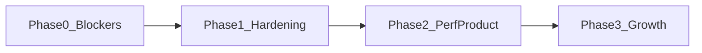

# Launch Hardening Plan

Sequenced plan to clear launch blockers, harden security/ops for multi-instance Vercel, then ship performance fixes and high-leverage product features for a controlled beta.

**Default scope:** Phase 0 + Phase 1 first. Phase 2 for invite→open beta. Phase 3 is growth backlog.

---

## Phase 0 — Launch blockers (Week 1)

### 0.1 Ship `/subscribe` (Stripe path already exists)

Signup already redirects to `/subscribe?redirect=/sign-up` when free users hit `FREE_USER_LIMIT` (100) in `app/(auth)/sign-up/actions.ts`. Checkout helpers exist in `utils/server/stripe.server.ts`; webhook already updates `User.subscriptionStatus` / `subscriptionId`.

**Build:**

- `app/subscribe/page.tsx` — explain free-cap, CTA to Checkout
- Server action or API — `createCheckoutSession` with success/cancel URLs
- `app/subscribe/success/page.tsx` — confirm session, then continue signup / `redirect` query
- Document `STRIPE_PRICE_ID` + publishable key in `.env.example`
- i18n keys in `messages/en.json` (+ sync `es` / `fr` / `it`)

**Done when:** free-cap user → Checkout → webhook → paid user can sign up.

### 0.2 Production error monitoring (Sentry)

`utils/errorHandling.ts` `sendToExternalLogger` is console-only today.

**Build:**

- Add `@sentry/nextjs`; init client/server/edge for App Router
- Implement `sendToExternalLogger` → `Sentry.captureException` with `correlationId` + redacted context
- Env: `SENTRY_DSN` (and CI auth token as needed); document in `.env.example`
- Alert on unhandled API 5xx + auth failure spikes

Maps to OPS-002 in `docs/QOL_AND_OPERATIONS_PLAN.md`.

### 0.3 Security headers

None today in `next.config.ts` / `proxy.ts`.

**Build** via `headers()` in `next.config.ts`:

- `Strict-Transport-Security`
- `X-Content-Type-Options: nosniff`
- `Referrer-Policy`
- `Permissions-Policy` (camera/mic/geolocation off)
- `X-Frame-Options: DENY` (or CSP `frame-ancestors 'none'`)
- Start CSP in **Report-Only**, then enforce after fixing inline/script gaps (Sanity studio, analytics)

### 0.4 Unify env validation

- Merge missing keys into root `.env.example`: Resend, Sanity, VAPID, clarify `JWT_SECRET` vs any legacy `SESSION_SECRET`
- Extend `scripts/validate-env.js` for required prod set
- Fail deploy/startup loudly when `JWT_SECRET`, `DATABASE_URL`, Stripe (if paid path on), R2 (if uploads on) missing

### 0.5 Stripe live smoke (ops checklist)

- Webhook endpoint on Vercel with `STRIPE_WEBHOOK_SECRET`
- Test then live `STRIPE_PRICE_ID`
- One paid signup end-to-end
- Confirm cancel/update subscription events update the user row

---

## Phase 1 — Hardening for multi-instance (Week 2)

### 1.1 GitHub Actions CI

No `.github/workflows` today. Add:

- PR: `npm ci` → typecheck → vitest → knip (or `npm run validate`)
- Main: same + optional production build
- Keep husky pre-push as local gate

### 1.2 Playwright smoke (minimal)

Cover: sign-in, archive browse, exchange list, create trade (auth fixture), admin unauthorized redirect.

Seed from `docs/live-testing.md`.

### 1.3 SSRF guards (admin scraper + R2 migrate)

Shared helper (e.g. `utils/server/safe-fetch-url.server.ts`):

- Allow only `http:` / `https:`
- Block localhost, RFC1918, link-local, cloud metadata (`169.254.169.254`)
- Use in: `lib/scraper/detect-platform.ts`, scraper run URL intake, `lib/r2-migrate.ts`, PDP bootstrap fetches

### 1.4 Redis-backed rate limits (Upstash)

- Replace in-process `Map` in `utils/api-validation.server.ts` with Upstash Redis sliding window
- Keep env knobs in `utils/rate-limit-config.server.ts`
- Wire real data into `utils/security/rate-limit-monitor.server.ts` so `/admin/security-monitor` is useful

### 1.5 Cron + schema policy

- Add `data-quality-snapshot` to `vercel.json` with `CRON_SECRET`
- Document clearly: **prod = `prisma migrate deploy`**; local may use `db push` — resolve conflict between Cursor rule and `docs/database-migrations.md`

### 1.6 Typeahead Cloudflare iframe guard

In `components/Molecules/SearchTypeahead/SearchTypeahead.tsx`: catch cross-frame `SecurityError` on scroll/position so tunnel/iframe embedding cannot crash the page; fall back to non-portal or static positioning.

---

## Phase 2 — Performance + must-ship product (Week 3–4)

### 2.1 Query fan-out fixes

| Hot spot | Fix |
|----------|-----|
| `models/follow-alerts.server.ts` | Batch prefs + bulk insert alerts |
| `models/compare.server.ts` | One query for all perfume ratings |
| `models/user-follow.server.ts` | Grouped aggregates instead of per-user counts |
| `fetchAllPerfumesForCatalog` | Paginate / avoid full walk on hot API paths |

### 2.2 Saved searches + alerts (CF-020–023)

Only open Tier A items in `docs/CUSTOMER_FEATURES_BACKLOG.md`:

- Persist search criteria per user
- Rules for availability / new matches
- Alert center mute/snooze + frequency (instant/daily)

Reuse existing alerts + push infrastructure.

### 2.3 Beginner language (notes + onboarding)

- Perfume form / TagSearch: clarify Top / Heart / Base (“first smell / middle / lasts on skin”)
- Soften onboarding copy in `messages/en.json` (`onboarding.*`)
- Sync locales via existing i18n skill

### 2.4 Scraper reliability (ops-facing)

- Shopify `products.json` / per-product `.json` **429 backoff + retry**
- ChromeDriver major pin/detect for undetected-chromedriver
- Admin: re-extract from `merchantNotesText` without full re-scrape

---

## Phase 3 — Growth backlog (post-beta)

- Shadows Plus packaging beyond bare checkout
- Listing boosts, affiliate links (`docs/MONETIZATION_PLAYBOOK.md`)
- Enable trader feedback (`models/traderFeedback.server.ts` currently disabled)
- Seasonal suggestions (CF-061), wishlist nudges (CF-062)
- Structured logs OPS-001; optional job queue for scraper/heavy work
- Enforce CSP after Report-Only is clean

---

## Acceptance criteria — ready for invite beta

- [ ] Free-cap user can pay via `/subscribe` and complete signup
- [ ] Sentry receives a test exception from prod/preview
- [ ] Security headers present on HTML responses
- [ ] `validate-env` fails closed on missing prod secrets
- [ ] CI green on PRs
- [ ] SSRF blocklist tested (localhost/metadata rejected)
- [ ] Rate limits survive multi-instance (Upstash)
- [ ] Legal pages reviewed (terms, community policy, no-funds disclaimer)

---

## Execution notes

- Do **not** use destructive DB ops; prod schema via migrate deploy only.
- Prefer additive schema for saved searches/alerts.
- Ship Phase 0 as a short PR series (subscribe → Sentry → headers/env) so invite beta can start while Phase 1 lands.
- Do not expand monetization UI until `/subscribe` + webhook are proven.

## Concrete tech choices (locked)

| Concern | Choice |
|---------|--------|
| Error monitoring | Sentry (`@sentry/nextjs`) |
| Shared rate limits | Upstash Redis |
| Paid signup | Build `/subscribe` on existing Stripe Checkout helpers |
| Security headers | `next.config.ts` `headers()`; CSP Report-Only first |
| CI | GitHub Actions running `npm run validate` |
| E2E | Playwright smoke only (not full coverage) |
