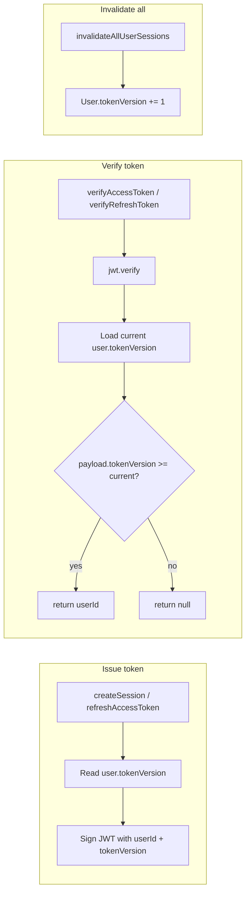

# Token Security

Implement session invalidation via a **tokenVersion** counter so that password change and "invalidate all sessions" actually revoke existing JWTs.

## Current behavior

- JWTs are issued with `userId` and `type`; once valid, they stay valid until expiry (access 1h, refresh 7d).
- `invalidateSession` and `invalidateAllUserSessions` in `utils/security/session-manager.server.ts` are no-ops.
- After a password change, `invalidateAllSessions(userId)` is called but existing tokens remain valid.

## Target behavior

- Every access and refresh token carries the user's `tokenVersion` at issue time.
- On each verification, compare payload `tokenVersion` to the user's current DB `tokenVersion`; reject if payload version is lower.
- `invalidateAllUserSessions(userId)` increments `User.tokenVersion` in the DB so all existing tokens for that user fail verification.

## Flow

---

## Implementation checklist

### Schema and migration

- [ ] Add `tokenVersion Int @default(0)` to `User` in `prisma/schema.prisma`.
- [ ] Run migration: `npx prisma migrate dev --name add_user_token_version`.

### User query helper

- [ ] In `models/user.query.ts`, add `getUserTokenVersion(userId: string): Promise<number | null>` that fetches only `tokenVersion` for the user (e.g. `findUnique` with `select: { tokenVersion: true }`).

### Session manager (`utils/security/session-manager.server.ts`)

- [ ] Change `createAccessToken(userId, tokenVersion)` and add `tokenVersion` to the JWT payload.
- [ ] Change `createRefreshToken(userId, tokenVersion)` and add `tokenVersion` to the JWT payload.
- [ ] Update `createSession` to accept `tokenVersion` (optional; if omitted, call `getUserTokenVersion(userId)`). Pass `tokenVersion` into `createAccessToken` and `createRefreshToken`.
- [ ] Make `verifyAccessToken` async: after `jwt.verify`, load current version via `getUserTokenVersion(userId)`; if payload has no `tokenVersion` treat as invalid (or as 0); if `payload.tokenVersion < currentVersion` return `null`, else return `{ userId }`.
- [ ] Make `verifyRefreshToken` async with the same tokenVersion check.
- [ ] In `refreshAccessToken`, after verifying refresh token get current `tokenVersion` and pass it into `createAccessToken` (and optionally new refresh token).
- [ ] Implement `invalidateAllUserSessions(userId)`: import `prisma` from `@/lib/db` and run `prisma.user.update({ where: { id: userId }, data: { tokenVersion: { increment: 1 } } })`.
- [ ] Leave `invalidateSession` as-is (no-op) or document that only "invalidate all" is supported per user.

### Callers that create sessions

- [ ] In `app/(auth)/sign-in/actions.ts`, pass `tokenVersion: existingUser.tokenVersion` into `createSession` (ensure Prisma returns `tokenVersion` from `signInCustomer`).
- [ ] In `app/(auth)/sign-up/actions.ts`, pass `tokenVersion: user.tokenVersion` into both `createSession` calls.

### Callers that verify tokens

- [ ] In `utils/session-from-request.server.ts`, change `verifyAccessToken(accessToken)` to `await verifyAccessToken(accessToken)` (verifyAccessToken is now async).
- [ ] In `models/session.server.ts`, change `verifyAccessToken(accessToken)` to `await verifyAccessToken(accessToken)` in `getUserFromToken`.

### Verification

- [ ] Confirm `lib/db` does not import session-manager (no circular dependency).
- [ ] After implementation: change password and confirm existing sessions are rejected until user signs in again.
