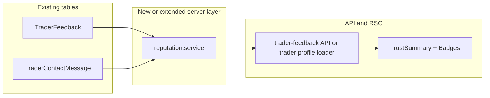

# Trader reputation (layer v1)

**Backlog:** CF-030 (reputation score), CF-031 (badges), CF-032 (public trust summary)  
**Spec version:** v1 (rule-based, explainable)  
**Source plan:** Derived from the Reputation Layer v1 implementation plan.

## Overview

Deliver an explainable v1 reputation model on top of existing `TraderFeedback` and `TraderContactMessage` data: server-side computation, API/RSC exposure, and a compact public trust summary plus badge breakdowns on the trader profile (and optionally on exchange surfaces).

---

## Current state

| Area | Detail |
|------|--------|
| Peer feedback | [`prisma/schema.prisma`](../prisma/schema.prisma) — `TraderFeedback`: 1–5 `rating`, optional `comment`, one row per `(traderId, reviewerId)`. |
| Aggregation | [`models/traderFeedback.server.ts`](../models/traderFeedback.server.ts) — `getTraderFeedbackSummary` → `averageRating`, `totalReviews`, `badgeEligible` (`totalReviews >= 10`). |
| Profile UI | [`components/Containers/TraderProfile/TraderFeedbackSection.tsx`](../components/Containers/TraderProfile/TraderFeedbackSection.tsx) — stars, average, count, single generic badge when `badgeEligible`. |
| Messaging | `TraderContactMessage` — `senderId`, `recipientId`, `createdAt`, `read`; **no thread id**. First-reply timing is approximated with paired-message heuristics in v1 (limitations must be documented). |
| Gap | No unified reputation score, no multi-badge breakdown (fast / reliable / top reviewed), no compact trust summary for reuse (e.g. exchange cards, message headers). |

There is **no** trade-completion or dispute model today. “Reliable trader” in v1 is defined from **feedback and messaging proxies** until verified trade markers exist (see [`docs/CUSTOMER_FEATURES_BACKLOG.md`](CUSTOMER_FEATURES_BACKLOG.md), e.g. CF-042).

---

## Guiding constraints

- **Explainability:** Any score or badge must map to visible rules (align with UX guardrails in [`docs/CUSTOMER_FEATURES_BACKLOG.md`](CUSTOMER_FEATURES_BACKLOG.md)).
- **Trust metrics to watch:** message acceptance rate, profile bounce, dispute rate trend — add logging/analytics hooks where cheap (e.g. trust summary expanded, trader contacted).

---

## Architecture (v1)

**Compute strategy:** On-read aggregation in a dedicated module (no new tables initially). Add indexes only if slow logs justify it. Optional later: `User.traderReputationCached` JSON + nightly refresh if p95 latency hurts.

---

## Product rules (lock before coding)

Document a **versioned v1 spec** (repo markdown or comment block in the reputation service) covering:

### Reputation score (CF-030)

- Map `averageRating` (1–5) and `totalReviews` into a **0–100** score with floors/ceilings.
- Require `minReviews` before showing a numeric score; otherwise e.g. “New — not enough data”.
- Optional blend: `feedbackScore = f(avg, n)` and `responseScore = g(medianHoursToFirstReply)` with explicit weights; UI copy e.g. “Based on X reviews and Y conversations.”

### Badges (CF-031)

Rule-based, **mutually independent** toggles, for example:

- **Top reviewed:** `totalReviews >= N` and `averageRating >= R` (evolves current `badgeEligible`).
- **Reliable trader:** stricter thresholds, or “no feedback below 3 stars in last M reviews” if time-window queries exist.
- **Fast responder:** median (or 75th percentile) first-reply time when user is **recipient**, with minimum sample; **document** heuristic pairing without formal threads.

### Public trust summary (CF-032)

- One **above-the-fold** block on [`app/trader-profile/[id]/TraderProfileClient.tsx`](../app/trader-profile/[id]/TraderProfileClient.tsx): score (or insufficient data), star average, review count, 2–3 badges max, “Why?” expander with rules that fired.

---

## Phased implementation checklist

### Phase 1 — Product rules and spec

- [ ] Publish versioned v1 rules: score formula, `minReviews`, floors/ceilings.
- [ ] Define optional `responseScore` and blending with `feedbackScore` (weights, thresholds).
- [ ] Define badge thresholds (N, R, M, reply-time percentiles, min conversation samples).
- [ ] Document messaging heuristic assumptions and v1 limitations (no threads).
- [ ] Align copy strategy with i18n keys (`traderProfile.reputation` or similar).

### Phase 2 — Server implementation

- [ ] Add `services/reputation/` parallel to existing services (e.g. [`services/recommendations/`](../services/recommendations/)):
  - [ ] `types.ts` — `TraderReputationV1`, `ReputationBadgeId`, `ReputationExplanation`.
  - [ ] `computeReputation.ts` — pure functions from summary + message stats → score, badges, explanation fragments.
  - [ ] `loadReputationInputs.server.ts` — Prisma: reuse `getTraderFeedbackSummary` + `TraderContactMessage` aggregates (no message body in public DTO).
- [ ] Choose wire-up **A** or **B**:
  - [ ] **A:** Extend `getTraderFeedbackForProfile` in [`models/traderFeedback.server.ts`](../models/traderFeedback.server.ts); extend [`app/api/trader-feedback/route.ts`](../app/api/trader-feedback/route.ts) GET JSON.
  - [ ] **B:** `getTraderReputation(traderId)` from RSC [`app/trader-profile/[id]/page.tsx`](../app/trader-profile/[id]/page.tsx) + slim API if exchange needs it.
- [ ] Unit tests: `computeReputation` — 0 reviews, one review, high avg low n, empty message stats.
- [ ] Optional: Prisma integration tests for message heuristic.

### Phase 3 — UI

- [ ] Add `TraderTrustSummary` under [`components/Containers/TraderProfile/`](../components/Containers/TraderProfile/) (DTO-driven).
- [ ] Score, stars, count, badge chips, accessible “What this means” disclosure.
- [ ] Place **above** `TraderFeedbackSection` in `TraderProfileClient`.
- [ ] Add `messages/*.json` keys; parameterized strings for thresholds.
- [ ] **Optional:** Minimal trust snippet on exchange rows [`app/the-exchange/TheExchangeClient.tsx`](../app/the-exchange/TheExchangeClient.tsx) — batched query or batch endpoint (avoid N+1).

### Phase 4 — Deprecate / align legacy badge

- [ ] Replace or map `badgeEligible` / `badgeLabel` to new badges (avoid duplicate chips for one release if needed).
- [ ] Update [`lib/queries/traderFeedback.ts`](../lib/queries/traderFeedback.ts) types if API shape grows.

---

## Risks and mitigations

| Risk | Mitigation |
|------|------------|
| “Fast responder” noisy without threads | Require sufficient sample; explain “based on contact messages”; iterate when threading improves. |
| Score feels arbitrary | Keep v1 rule-based; show formula hints in UI. |
| Gaming (fake reviews) | Existing rate limits; future “only after contact” eligibility if needed. |
| Profile load performance | On-read first; index `(recipientId, createdAt)` if needed; batch for exchange. |

---

## Definition of done

- [ ] **CF-030:** Single v1 reputation score (or explicit “not enough data”) on public trader profile.
- [ ] **CF-031:** Multiple labeled badges with explainable criteria in UI.
- [ ] **CF-032:** Trust summary visible without scrolling the full feedback list; public-safe payload.
- [ ] Unit tests for scoring and badge edge cases; manual QA for 0 / 1 / many reviews.

---

## Related files (quick reference)

| File | Role |
|------|------|
| `prisma/schema.prisma` | `TraderFeedback`, `TraderContactMessage` |
| `models/traderFeedback.server.ts` | Existing summary aggregation |
| `components/Containers/TraderProfile/TraderFeedbackSection.tsx` | Current feedback UI |
| `app/trader-profile/[id]/TraderProfileClient.tsx` | Profile shell for trust summary |
| `app/api/trader-feedback/route.ts` | Optional API extension |
| `lib/queries/traderFeedback.ts` | Client types / queries |
